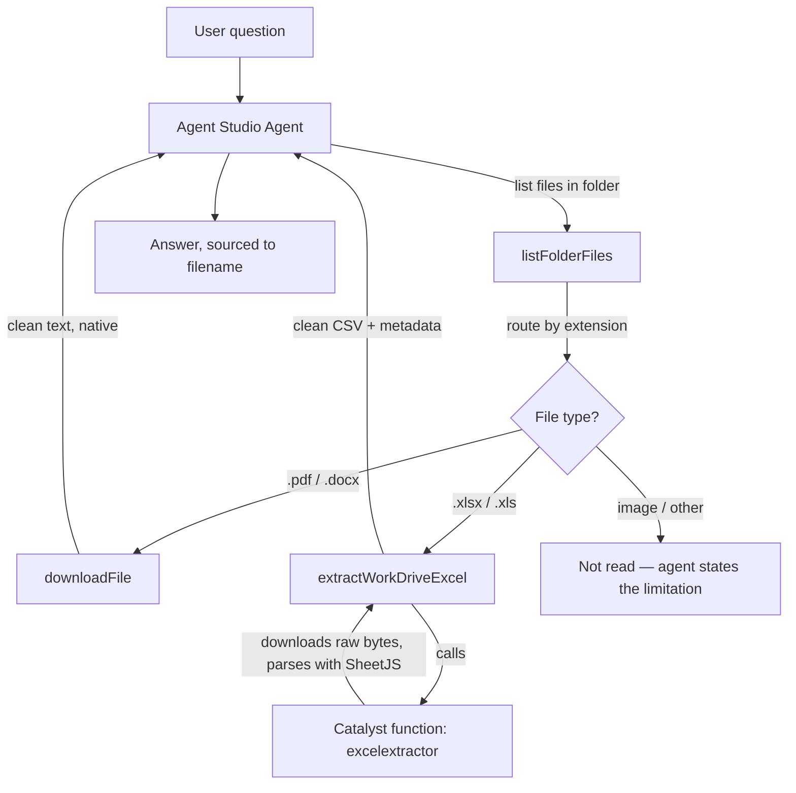

# Fixing-File-Type-Handling-in-Zoho-Agent-Studio-Document-Agents
A custom tool in Zoho's Agent Studio returns unreadable binary and raw bytes for Excel and Image files. This approach fixes the output for Excel Files and allows an agent to read and extract from them natively and efficiently.

---

## Table of Contents

- [The problem](#the-problem)
- [File-type behavior matrix](#file-type-behavior-matrix)
- [Architecture of the fix](#architecture-of-the-fix)
- [Diagnosis](#diagnosis)
- [Component 1 — Custom WorkDrive tools in Agent Studio](#component-1--custom-workdrive-tools-in-agent-studio)
- [Component 2 — Catalyst Excel Extractor function](#component-2--catalyst-excel-extractor-function)
- [Component 3 — Agent-side routing logic](#component-3--agent-side-routing-logic)
- [Setup guide (reproducing this from scratch)](#setup-guide-reproducing-this-from-scratch)
- [API reference — `extract-excel`](#api-reference--extract-excel)
- [Platform quirks & findings](#platform-quirks--findings)
- [Verified test results](#verified-test-results)
- [Open items / next steps](#open-items--next-steps)

---

## The problem

Any Agent Studio agent built to read files from a document store (WorkDrive, in this case) via a custom tool needs to know one thing before it can be trusted: **which file types it can actually read, and which ones it only looks like it can read.**

Agent Studio's file-handling layer applies an automatic conversion step before the agent sees a downloaded file's content — but that conversion only covers some formats. For the rest, the raw bytes are passed straight through, and an agent with no guardrails will happily try to summarize a ZIP header or a PNG's binary data as if it were text. That's a correctness bug, not a crash, which makes it dangerous — the agent doesn't fail, it hallucinates confidently from garbage input.

## File-type behavior matrix

| File type | What a custom `downloadFile`-style tool actually returns | Usable as-is? |
|---|---|---|
| `.pdf` | Auto-converted to clean structured text: `{status, file, format, content}` | ✅ Yes |
| `.docx` | Auto-converted to clean structured text, same shape | ✅ Yes |
| `.xlsx` / `.xls` | Raw unconverted bytes — content starts with `PK` (the ZIP container signature every XLSX file is built on) | ❌ No — gibberish |
| images (`.png`, `.jpg`, etc.) | Raw unconverted binary | ❌ No — gibberish |

This split isn't documented anywhere in Zoho's public references — it was found by testing each file type directly and inspecting what the tool actually returned, not by reading a spec.

## Architecture of the fix



Only the Excel path needed a fix here; PDFs and DOCX already work natively, and images were left out of scope (no OCR built).

## Diagnosis

1. **Built-in WorkDrive tool tested first** (`workdrive_getFolderFiles`) — failed consistently with a 500 error in under 20ms. The very short response time indicated a wrapper-level failure inside Agent Studio itself, not a real WorkDrive API round-trip, so a custom tool was built instead of chasing that error further.
2. **Custom `downloadFile` tool built and tested per file type** — PDF and DOCX returned clean text on the first attempt with no special handling required. XLSX and image files did not: the response for XLSX began with `PK` (a raw ZIP file signature, since XLSX is a ZIP container internally), and images came back as unreadable binary.
3. **Conclusion:** Agent Studio's custom-tool file layer silently applies conversion for some formats and not others. Images were deliberately scoped out (no OCR path). Excel was in scope and solvable, since a parsing library could be run outside Agent Studio entirely.

## Component 1 — Custom WorkDrive tools in Agent Studio

A custom OpenAPI 3.0 tool group ("Workdrive Tools"), using a Zoho OAuth **Connection** named `zohoworkdrive` scoped to `WorkDrive.files.READ`.

| Operation | Method / path | Purpose |
|---|---|---|
| `listFolderFiles` | `GET /workdrive/api/v1/files/{folder_id}/files` | Returns name, ID, and type for every file in a folder |
| `downloadFile` | `GET /workdrive/api/v1/download/{file_id}` | Downloads a file; native for PDF/DOCX only |

**Non-obvious YAML requirements** (each cost a validation failure to discover):
- Server base URL must be `https://www.zohoapis.com`, with the **full service path** (`/workdrive/api/v1/...`) inside each operation — not baked into the server URL.
- Agent Studio's validator requires an explicit `securitySchemes` block under `components`, **even when a Zoho Service connection is already selected in the UI**. Omitting it produces a "security definition is missing" error per endpoint.

## Component 2 — Catalyst Excel Extractor function

**Function name:** `excelextractor` · **Stack:** Node.js 24 · **Type:** Advanced I/O

### Why a separate function, and why Node

Catalyst functions run outside Agent Studio's file-handling layer entirely, so a function can fetch the raw XLSX bytes and parse them properly instead of being subject to Agent Studio's silent binary pass-through. Node was used because **SheetJS**, the library that actually parses `.xlsx`, is a mature, well-supported JS library with no equivalent-quality first-class option in Catalyst's other supported stacks.

SheetJS is no longer distributed via the public npm registry, so it's **vendored directly** as a single bundled file at `vendor/xlsx.full.min.js` (~930KB, v0.20.3) rather than pulled in via `package.json`/`node_modules`. This is deliberate — if `node_modules` is ever regenerated from `package.json`, the `vendor/` folder must be preserved manually or the function breaks.

### Authentication — Catalyst Connections

The Catalyst function is a separate runtime from Agent Studio, so it does **not** inherit the `zohoworkdrive` connection made for the custom OpenAPI tools in Component 1. It needs its own.

Catalyst's **Connections** component (Cloud Scale → Connections) was used rather than the older **Connectors** component or a manual Zoho self-client — it's the newer, simpler path and skips manual refresh-token handling entirely.

- Connection Link Name: `zohoworkdrive`
- Scope enabled: `WorkDrive.files.READ` only (deliberately minimal — the function only ever downloads a file by ID)
- SDK call: `app.connections().getConnectionCredentials('zohoworkdrive')`

**Gotcha found during build:** the Catalyst Node SDK bundled in the initial function template was `zcatalyst-sdk-node@2.2.1`, which has no `.connections()` method at all — it was added in a later SDK version. Upgrading to `3.4.0` fixed it.

**Gotcha found during build (auth shape):** `getConnectionCredentials()` doesn't return a bare access token — it returns `{ headers, parameters }`, i.e. **ready-made request headers** with the `Authorization` value already formatted. The fix was to spread `cred.headers` straight into the `fetch` call instead of hunting for an `access_token` field.

### Function code (core logic, auth-corrected version)

```javascript
"use strict";

const express = require("express");
const catalyst = require("zcatalyst-sdk-node");
const XLSX = require("./vendor/xlsx.full.min.js");

const app = express();
app.use(express.json());

const CONNECTION_NAME = "zohoworkdrive";
const MAX_ROWS_PER_SHEET = 500; // later raised to 2000 with pagination — see below

// Health check
app.get("/", (req, res) => {
  res.status(200).json({
    status: "success",
    message: "Excel Extractor is live and ready.",
    excel_parser_version: XLSX.version
  });
});

// Main extraction route
app.post("/extract-excel", async (req, res) => {
  const { file_id } = req.body;

  if (!file_id) {
    return res.status(400).json({ status: "error", message: "file_id is required." });
  }

  try {
    // 1. Get ready-made auth headers from the Catalyst Connection
    const capp = catalyst.initialize(req);
    const connections = capp.connections();
    const cred = await connections.getConnectionCredentials(CONNECTION_NAME);

    if (!cred || !cred.headers) {
      return res.status(500).json({
        status: "error",
        message: "Connection returned no headers.",
        credential_raw: cred
      });
    }

    // 2. Download the file from WorkDrive
    const url = "https://www.zohoapis.com/workdrive/api/v1/download/" + file_id;
    const wdRes = await fetch(url, { method: "GET", headers: Object.assign({}, cred.headers) });

    if (!wdRes.ok) {
      const body = await wdRes.text();
      return res.status(502).json({
        status: "error",
        message: "WorkDrive download failed.",
        http_status: wdRes.status,
        detail: body.slice(0, 500)
      });
    }

    const buffer = Buffer.from(await wdRes.arrayBuffer());

    // 3. Parse with SheetJS
    const wb = XLSX.read(buffer, { type: "buffer" });

    const sheets = wb.SheetNames.map((name) => {
      const ws = wb.Sheets[name];
      const rows = XLSX.utils.sheet_to_json(ws, { header: 1, blankrows: false, defval: "" });
      const trimmed = rows.slice(0, MAX_ROWS_PER_SHEET);
      return {
        sheet_name: name,
        total_rows: rows.length,
        rows_returned: trimmed.length,
        truncated: rows.length > trimmed.length,
        csv: trimmed.map((r) => r.join(",")).join("\n")
      };
    });

    return res.status(200).json({
      status: "success",
      file_id: file_id,
      format: "xlsx",
      sheet_count: sheets.length,
      sheets: sheets
    });
  } catch (err) {
    return res.status(500).json({
      status: "error",
      message: "Extraction failed.",
      detail: err && err.message ? err.message : String(err)
    });
  }
});

module.exports = app;
```

### Enhancements added after the version above (confirmed working, exact final source not fully captured)

Tested and verified against a real ~8,800-row exported spreadsheet before being wired into the agent:

- **Real dates, not Excel serials** — `cellDates: true` + `raw: false` in the parse options. Verified a raw serial like `43367.47` renders as an actual date instead of a float.
- **Proper CSV escaping** — commas and quotes inside cell values no longer break column alignment (verified with a value containing an embedded comma).
- **Pagination** — row cap raised from 500 to **2,000 per call**, with `has_more` / `next_start_row` in the response so a large sheet is fetched in pages instead of silently truncated.
- **`columns` returned separately** from the data rows, so the schema is known up front, including on later pages.
- **`summary_only: true` mode** — returns just the column list, row count, and 5 sample rows. A cheap way to preview a workbook before pulling the full data.
- **`visible_rows_only` flag** — respects a workbook's saved Excel filter/hidden rows by default; the response separately reports `total_data_rows` (visible), `underlying_data_rows` (including hidden/filtered), and `hidden_rows_excluded`.

The tool was wired into Agent Studio as **`extractWorkDriveExcel`**, replacing an earlier instruction line that told the agent it simply couldn't read spreadsheets.

## Component 3 — Agent-side routing logic

The critical piece that makes this safe isn't just having the right tool — it's making sure the agent never sends raw binary to itself or the user. Key instruction rules:

**Routing by extension:**
- `.xlsx` / `.xls` → always `extractWorkDriveExcel`, **never** `downloadFile`. Content starting with `PK` (raw XLSX binary) must never reach the model or the user.
- `.pdf` / `.docx` → always `downloadFile`, never `extractWorkDriveExcel`.
- Images / unsupported types → not read at all; the agent states plainly that it can't inspect the file rather than guessing at its contents.

**Read summary before full data:** for Excel, the agent always calls `extractWorkDriveExcel` with `summary_only: true` first, to understand columns and row count cheaply before deciding whether a full pull is needed.

**Pagination discipline:** follows `has_more` / `next_start_row` until the answer is found or the sheet is exhausted; never claims data is absent before checking all relevant pages.

**Failure handling:** if `extractWorkDriveExcel` fails, the agent never falls back to `downloadFile` for that file — that would just expose raw binary. It names the failed file and explains the error instead of inventing an answer.

**CSV parsing discipline:** commas/quotes inside quoted fields don't split columns; values (IDs, phone numbers, emails, etc.) are copied character-for-character, never reformatted or "corrected."

**Sourcing:** every answer names the source file (and worksheet, for Excel); document facts are clearly separated from missing information; no filling gaps with assumptions.

## Setup guide (reproducing this from scratch)

1. **Agent Studio → Connections** — create a Zoho Service connection named `zohoworkdrive`, scope `WorkDrive.files.READ`.
2. **Agent Studio → Custom Tools** — create an OpenAPI 3.0 tool group with `listFolderFiles` and `downloadFile` operations as documented above, remembering the explicit `securitySchemes` block.
3. **Zoho Catalyst project** — create an Advanced I/O function (`excelextractor`, Node.js 24).
4. **Catalyst → Cloud Scale → Connections** — create a connection also named `zohoworkdrive`, scope `WorkDrive.files.READ` only, and note it's a **separate connection from step 1** (different runtime, doesn't inherit auth).
5. Vendor SheetJS into `vendor/xlsx.full.min.js` inside the function bundle (not via `package.json`, since it isn't on npm).
6. Use `zcatalyst-sdk-node@3.4.0` or later — `2.2.1` lacks `.connections()`.
7. Deploy the function, hit the base `/` route to confirm the health check returns `excel_parser_version`.
8. Test `/extract-excel` directly via `curl` before wiring into Agent Studio (see API reference below).
9. Back in Agent Studio, add a third custom tool (`extractWorkDriveExcel`) pointing at the Catalyst function's Invocation URL, and add the routing/pagination/failure-handling rules from Component 3 to the agent's instructions.
10. Deploy last — deploying locks agent parameters entirely, so all tool and instruction changes should be finalized first.

## API reference — `extract-excel`

**Endpoint:** `POST {catalyst-invocation-url}/server/excelextractor/extract-excel`

**Request body:**

| Field | Type | Required | Notes |
|---|---|---|---|
| `file_id` | string | yes | WorkDrive file ID (top-level `id` from `listFolderFiles`, not the folder ID) |
| `summary_only` | boolean | no | If `true`, returns only columns, row count, and 5 sample rows |
| `visible_rows_only` | boolean | no | If `true` (recommended default), honors the workbook's saved Excel filter and excludes hidden/filtered rows |
| `start_row` | integer | no | Pagination offset |
| `max_rows` | integer | no | Page size, up to 2,000 |

**Response (full pull):**

```json
{
  "status": "success",
  "file_id": "gqi4c...",
  "format": "xlsx",
  "sheet_count": 1,
  "sheets": [
    {
      "sheet_name": "Sheet0",
      "columns": ["Column A", "Column B", "..."],
      "total_data_rows": 8791,
      "underlying_data_rows": 8791,
      "hidden_rows_excluded": 0,
      "rows_returned": 2000,
      "has_more": true,
      "next_start_row": 2000,
      "csv": "..."
    }
  ]
}
```

**Response (`summary_only: true`), verified against a real ~8,800-row export:**

```json
{
  "status": "success",
  "file_id": "gqi4cfacac9e5b9fd451fa023664c6509638d",
  "format": "xlsx",
  "mode": "summary",
  "sheet_count": 1,
  "sheets": [
    {
      "sheet_name": "Sheet0",
      "columns": ["Column A", "Column B", "Column C", "..."],
      "total_data_rows": 8791,
      "sample_rows": ["...5 sample rows..."]
    }
  ]
}
```

## Platform quirks & findings

| Finding | Detail |
|---|---|
| Built-in WorkDrive tool broken | `workdrive_getFolderFiles` fails with a 500 error in <20ms — an Agent Studio wrapper bug, not a WorkDrive API issue |
| Silent binary pass-through | Agent Studio auto-converts PDF/DOCX to text for custom `downloadFile`-style tools, but returns **raw bytes** for XLSX and images with no warning — not documented anywhere by Zoho |
| YAML `securitySchemes` requirement | Required even when a Zoho Service connection is already selected in the tool UI, or validation fails per-endpoint |
| Catalyst SDK version | `zcatalyst-sdk-node` needs ≥3.4.0 for `.connections()` — the template-default 2.2.1 doesn't have it |
| `getConnectionCredentials()` shape | Returns `{ headers, parameters }` (ready-made request headers), not a bare access token |
| SheetJS distribution | No longer on public npm — must be vendored as a single bundled file, kept manually alongside `package.json` |
| Separate auth per runtime | A Catalyst function's Connection is entirely separate from an Agent Studio custom tool's Connection, even with the same name and scope — set up twice, in two different consoles |

## Verified test results

- A content question was answered correctly from a `.docx` file (the agent independently caught that payment percentages in the document summed to 110%).
- An Excel question correctly avoided the raw-binary path (no gibberish reached the model) even before `extractWorkDriveExcel` existed — confirming the routing-away behavior worked.
- An image question correctly skipped download and stated the limitation instead of guessing.
- A no-match question (asking for a value not present in any document) returned an honest "not found" rather than hallucinating from unrelated content.
- After `extractWorkDriveExcel` was built: summary mode confirmed real dates (not serials) and correct comma/quote handling on a live ~8,800-row spreadsheet, via direct `curl` testing against the Catalyst Invocation URL.
- All results confirmed via Agent Studio's **Observability tab** traces, not just chat output — agent reasoning summaries have been found to claim actions that tool-call traces don't actually confirm, so trace-level verification is standard practice.

## Open items / next steps

- Images remain explicitly out of scope (no OCR path built).
- Scanned (image-only) PDFs are untested through this specific pipeline; separately confirmed that Agent Studio's native PDF handling has no OCR, so a scanned PDF likely returns empty content the same way an image would.
- The exact final `index.js` for the pagination/hidden-rows/date-formatting version wasn't fully captured verbatim in this write-up (reconstructed from verified behavior + partial code); pull the deployed ZIP from Catalyst directly if a byte-exact copy is needed for the repo.
- Worth periodically checking the connected LLM's usage/credit limits before heavy Excel-testing sessions, since large sheets mean more tokens per answer.
